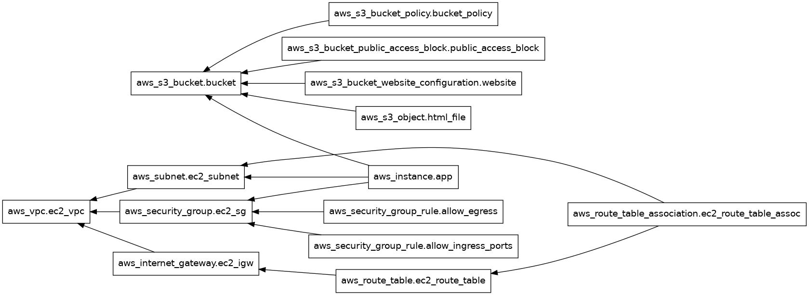

# Projeto ada-IaC (Provisionamento como código)

Este é o projeto de provisionamento da aplicação anti-fraude desenvolvida durante o módulo de Conteinerização na cloud Amazon Web Services - AWS usando Terraform.

## Dependências

Para o funcionamento de todas as etapas descritas abaixo se faz necessário que o usuário tenha instalado em sua máquina os pacotes/comandos abaixo:

- bash
- terraform
- ansible

## Primeiros passos

Assim que fizer o clone do projeto a primeira coisa que o usuário deve fazer é configurar o workspace que ele vai usar, através do script `extra_files/criar_workspace.sh` passando o nome do workspace como parâmetro.

exemplo:
```
user@hostname:~/ada-Iac$
extra_files/criar_workspace.sh prod
```

Neste momento o script fará nesta ordem:

- Entrada de dados (nome do projeto; região AWS; ID AWS access key; AWX secret key; ID da imagem AMI; tipo da instância EC2; nome de usuário para o Ansible) - valores default são definidos caso o usuário deixe campo em branco.
- Cria um par de chaves SSH para o usuário do Ansible.
- Cria um arquivo .tfvars para o nome de workspace definido, e escreve nele as variáveis definidas acima.
- Faz o `terraform init` e cria o workspace no Terraform.

Obs.: Tanto o arquivo .tfvars quanto o par de chaves SSH criados estão no .gitignore pois possuem dados sensíveis.

## Provisionando na AWS

Após a criação do workspace, basta aplicar a infraestrutura através do comando `terraform apply` passando o arquivo .tfvars criado como parâmetro em `--var-file` estando (PWD) na raiz do projeto.

exemplo:
```
user@hostname:~/ada-Iac$
terraform apply --var-file=prod.tfvars
```

Aqui o Terraform fará o provisionamento na AWS de:

- Um Bucket S3 (que foi criado para fins didáticos durante o curso) com o arquivo `extra_files/index.html`
- Uma instância EC2 com a imagem AMI definida e é executado dentro dela um script `extra_files/config_user.sh` via template em `user_data` para que seja criado o usuário do Ansible e os pacotes necessários ao seu funcionamento.
- Os recursos de rede e comunicação definidos em `network.tf`

Obs.1: O nome do Bucket S3 e o IP público criado para acesso à instância EC2 é exposto em `output.tf`

Obs.2: O desenho de dependências entre os recursos foram criados pelo comando `terraform graph` e estão visíveis em `architecture.png`:



## Configurando ambiente e subindo aplicação

Para configurar o ambiente e subir a aplicação (docker compose) dentro da instância, basta executar o script `extra_files/compose_up.sh` passando o IP público que foi disponibilizado em `output.tf` como parâmetro.

exemplo:
```
user@hostname:~/ada-Iac$
extra_files/compose_up.sh 10.123.456.789
```

Este script foi criado para faciliar a chamada do Playbook do Ansible `extra_files/config_instance.yml` que fará:

- Instalação do docker na instância e garantia do deamon do docker em execução.
- A copia da aplicação que está em `ansible/` para a instância dentro do diretório `/opt/app/`.
- Execução do comando `docker compose up --build` para subida da aplicação.

Obs.: Demais detalhes do funcionamento da aplicação podem ser obtidos através da consulta ao seu projeto em: https://github.com/luisfvalenca/ada-container

